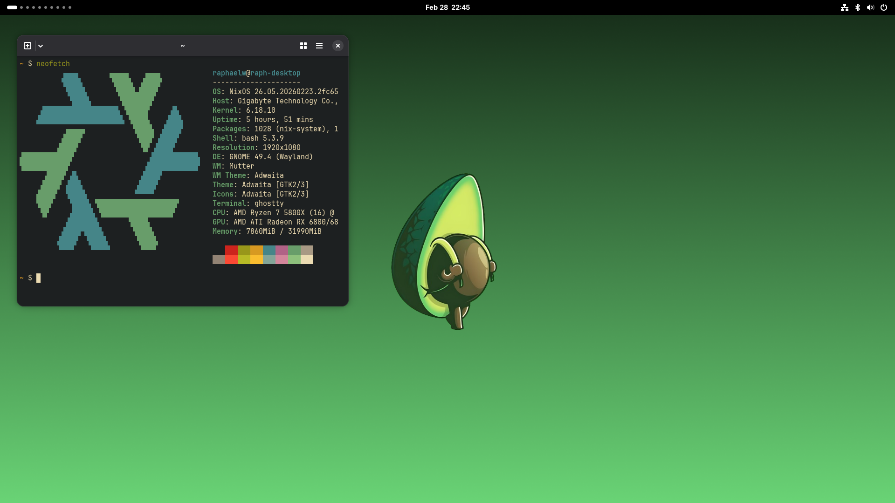

# My NixOS configurations


This repository contains NixOS configurations for my personal computers / servers.

It contains nixos configurations for the following hosts:

| **Host name** | **Type** | **Comment**                |
| ------------- | -------- | -------------------------- |
| interstellar  | desktop  | My personal laptop         |
| john          | desktop  | My personal desktop        |
| nanorion      | server   | Scaleway bare metal server |

## Structure

This configuration uses the [dentritic pattern](https://github.com/mightyiam/dendritic), or at least my interpretation of it.
To implement it, I used the following ressources:

- [Mightyjam's dentritic repository](https://github.com/mightyiam/dendritic)
- [Doc Steve's guide on dentritic design with flake parts](https://github.com/Doc-Steve/dendritic-design-with-flake-parts)
- [Gaetan Lepage's nix config](https://github.com/GaetanLepage/nix-config)
- [Drupol's 'Refactoring My Infrastructure As Code Configurations' article](https://not-a-number.io/2025/refactoring-my-infrastructure-as-code-configurations)
- [Drupol's infra repository](https://github.com/drupol/infra)

All of the nix code is in the `modules` directory, and imported automatically using
[Vic's import-tree](https://github.com/vic/import-tree)

The structure is as follows:

```
├── assets # external assets such as pictures and fonts
└── modules # flake-parts modules
    ├── desktop # desktop environment related configuration (cursor config, xdg config, ...)
    ├── hosts # per host configuration
    │   ├── interstellar
    │   ├── john
    │   └── nanorion
    ├── programs # programs to enable and their optional configuration
    ├── services # services or daemons
    └── system # system-level configuration (bootloader, bluetooth, ...)
```

Every file is a 'feature' in dentritic terms, and each type of feature is
highlighted
by the different directories. A feature may apply to personal computers, to servers
or to both. When a feature has specific configuration for the server machine type,
the associated module is suffixed with `-server` (example: [`boot.nix`](./modules/system/boot.nix))

## Flake output types

This flake provides two types of outputs:

#### 1. NixOS Configurations

Allows you to manage system configurations via `nixos-rebuild` for a specific machine.

#### 2. Wrapped Packages

Uses `perSystem` from [flake-parts](https://github.com/hercules-ci/flake-parts) to define packages as flake outputs. These packages can be used in two ways:

- **Included in a NixOS or home-manager configuration**:
  Add them to `environment.systemPackages` or `home.packages` to make them
  available on the host system (example:
  `self.packages.${pkgs.stdenv.hostPlatform.system}.<package-name>`)

- **Run directly with `nix run`**:
  Execute flake outputs on any machine with Nix installed.

---

### Packages Exposed by This Flake

| Package | Description                                                                                     | Run Command                                  |
| ------- | ----------------------------------------------------------------------------------------------- | -------------------------------------------- |
| `nvim`  | My personal Neovim configuration, built with [nixvim](https://github.com/nix-community/nixvim). | `nix run github:raphaelweis/nix-config#nvim` |

## Tools I use

| **Tool**            | **Name**                               |
| ------------------- | -------------------------------------- |
| Web browser         | [zen-browser](https://zen-browser.app) |
| Desktop environment | [Gnome](https://www.gnome.org)         |
| Terminal emulator   | [Ghostty](https://ghostty.org)         |
| Shell               | [zsh](https://zsh.org)                 |
| Code editor         | [Neovim](https://neovim.io)            |

Here is a screenshot of my current system:


## Rebuild commands

For desktop configurations:

```bash
sudo nixos-rebuild switch --flake .#<configuration-name>
```

For server configurations:

```bash
nixos-rebuild switch --flake .#<configuration-name> --target-host "root@<server-ip>"
```
